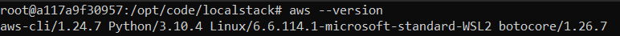
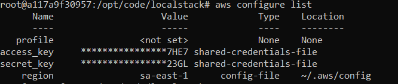
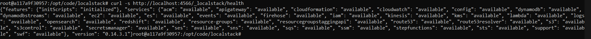
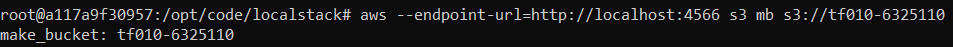
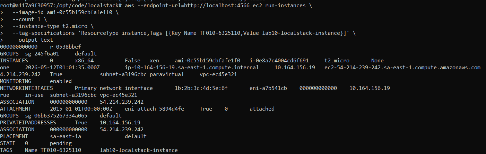
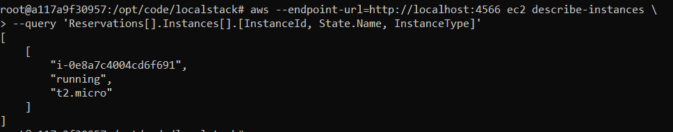

# Questão 1: Modelos de Serviço em Nuvem (Teórica)
Cloud Computing é dividido em modelos de serviço que definem o nível de gerenciamento do usuário.

a) Qual modelo de serviço a AWS EC2 (Elastic Compute Cloud) representa (IaaS, PaaS ou SaaS)? Explique qual é a principal responsabilidade do usuário neste modelo (ex: gerenciar o Sistema Operacional ou apenas usar o software?).
* O EC2 é estritamente IaaS (Infraestrutura como Serviço). A AWS gerencia o hardware físico, mas a sua responsabilidade é total sobre o Sistema Operacional, atualizações, patches de segurança e a aplicação.

b) Cite um exemplo de serviço da AWS que se encaixe no modelo SaaS (Software as a Service) ou PaaS (Platform as a Service).
* Como PaaS, destaco o AWS Elastic Beanstalk (abstrai a infraestrutura para focar no deploy). Como SaaS, um excelente exemplo é o Amazon QuickSight (plataforma de BI totalmente gerenciada).

# Questão 2: Identidade e Acesso (IAM) (Teórica)
O AWS IAM (Identity and Access Management) é o serviço de segurança e controle de acesso da AWS.

a) Qual é a diferença fundamental entre um Usuário IAM e um Grupo IAM?
* Um Usuário IAM é uma identidade individual com credenciais próprias (login ou access keys). Um Grupo IAM é um agrupador lógico de usuários criado exclusivamente para facilitar a aplicação de permissões em massa.

b) No contexto de segurança, explique por que é uma melhor prática criar uma Role IAM em vez de usar as chaves de um usuário Root ou Administrador para dar permissão a uma instância EC2 acessar um serviço como o S3.
* Roles utilizam credenciais temporárias e rotativas (STS), assumidas nativamente pelo EC2. Usar chaves estáticas, principalmente de Root, é a maior falha de segurança possível, pois expõe o ambiente inteiro em caso de vazamento no código.

# Questão 3: Rede Virtual na AWS (VPC) (Teórica)
A VPC (Virtual Private Cloud) é a fundação da rede na AWS, agindo como um datacenter virtual isolado.

a) Defina o conceito de Subnet dentro de uma VPC e explique a diferença crucial entre uma Subnet Pública e uma Subnet Privada.
* Subnet é a segmentação lógica dos IPs (bloco CIDR) da sua VPC. A diferença técnica e vital é que a Subnet Pública possui uma rota apontando para a internet, enquanto a Privada é isolada.

b) Qual componente de rede é obrigatório para que uma instância EC2 em uma Subnet Pública consiga se conectar à Internet (enviar e receber tráfego) e qual componente é usado para inspecionar o tráfego de entrada/saída em nível de Subnet?
* O componente essencial para habilitar o tráfego de internet é o Internet Gateway (IGW) anexado à VPC. Para inspecionar e bloquear tráfego no nível da Subnet (stateless), utilizamos o Network ACL (NACL).

# Questão 4: Instâncias EC2 (Prática Teórica)
O EC2 é a espinha dorsal de infraestrutura como serviço da AWS.

a) Ao lançar uma instância EC2, qual é o termo da AWS para a imagem do Sistema Operacional pré-configurado que você utiliza (ex: Ubuntu, Amazon Linux)?
* O termo padrão e fundamental da arquitetura AWS para essas imagens de inicialização é AMI (Amazon Machine Image).

b) Após lançar uma instância Linux (Ubuntu) e garantir que a porta 22 esteja aberta, qual comando Linux você usaria no seu terminal WSL para se conectar a esta instância usando o arquivo de chave minha_chave.pem? (Assuma que o endereço público da instância é ec2-user@54.123.45.67).
* Após restringir a permissão da chave localmente (``chmod 400 minha_chave.pem``), eu utilizaria o comando ``ssh -i "minha_chave.pem" ec2-user@54.123.45.67.``

## Questão 5: Comandos AWS CLI (Prática)
A Tarefa Prática exige o uso de comandos básicos do AWS CLI para gerenciar recursos na AWS.

### Cenário:
Você precisa executar ações comuns de infraestrutura usando a linha de comando no seu ambiente **WSL/Linux**.

### Instrua o comando correto para cada uma das seguintes operações:

1.  **Configurar credenciais:** Qual comando AWS CLI é usado para configurar as credenciais e região no seu ambiente local?
* O comando ``aws configure``. O CLI solicitará a Access Key, Secret Key, região padrão (ex: ``us-east-1``) e formato de saída desejado (geralmente ``json``).

2.  **Listar instâncias EC2:** Qual comando AWS CLI você usaria para listar todas as instâncias EC2 na região configurada?
* O comando ``aws ec2 describe-instances`` com a flag ``--query 'Reservations[*].Instances[*].[InstanceId,State.Name]' --output table`` para não poluir o terminal.

3.  **Criar um bucket S3:** Qual comando AWS CLI cria um bucket chamado `meu-bucket-tf10` na região `sa-east-1`?
* O comando ``aws s3 mb s3://meu-bucket-tf10 --region sa-east-1``.

4.  **Descrever VPCs:** Qual comando AWS CLI retorna as informações das VPCs existentes na região configurada?
* O comando ``aws ec2 describe-vpcs``.

## Questão 6: Evidências Práticas de Configuração e Criação de Recursos

Para esta questão, você deve fornecer evidências práticas baseadas no laboratório (Lab010.md). Use a AWS real ou LocalStack para executar os comandos e capture prints das saídas.

### Parte 1: Evidências de Configuração

Forneça prints (screenshots) das seguintes configurações no seu ambiente WSL/Linux:

1. **Instalação da AWS CLI:** Print do comando `aws --version` mostrando a versão instalada.

2. **Configuração de Credenciais AWS:** Print do comando `aws configure list` mostrando as credenciais configuradas (oculte chaves sensíveis).

3. **Instalação do LocalStack via Docker:**
* Print do comando `docker run` iniciando o LocalStack

* Print do `curl -s http://localhost:4566/_localstack/health` confirmando que está rodando.

4. **Teste de Conectividade LocalStack:** Print do comando `aws --endpoint-url=http://localhost:4566 s3 ls` mostrando a conectividade.

### Parte 2: Exercício de Criação de Recursos

Execute os seguintes passos na AWS real ou LocalStack e forneça prints das evidências:

1. **Criar um Bucket S3 com nome TF010:** Use o comando apropriado para criar um bucket chamado `tf010-<seu-ra>` (ex: `tf010-6325128`). Forneça print do comando e da saída confirmando a criação.

2. **Criar uma Instância EC2 com tag TF010:** Use o comando para criar uma instância EC2 com tag `Name=TF010-<seu-ra>`.
* Forneça print do comando `run-instances`

* Print do `describe-instances` mostrando a instância criada.

